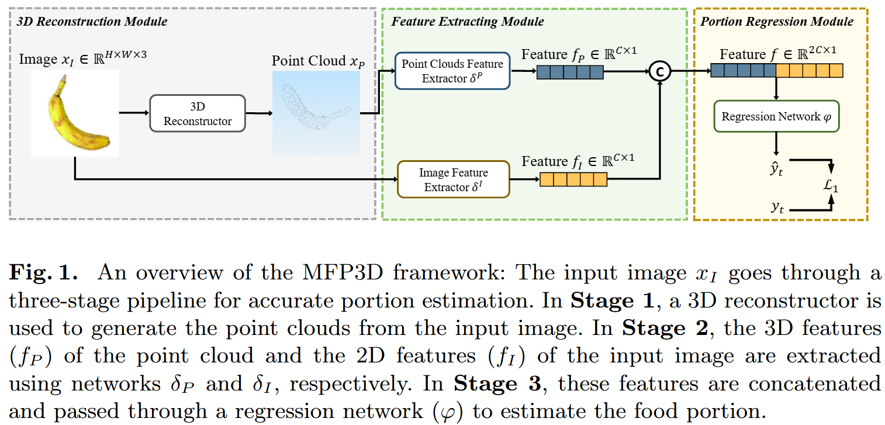

# MFP3D: Monocular Food Portion Estimation Leveraging 3D Point Clouds, ICPR, MADiMa[Oral], 2024

This repository provides the training and testing workflow for MFP3D, targeting monocular food portion estimation (e.g., volume, energy, and related nutrition attributes) with fused 2D RGB and 3D point cloud features.

**For the preprocessed datasets used in the paper, please download here: https://drive.google.com/drive/folders/1LLnCdxC_piPKTw2H0LsCxNu3hHkHfB6u?usp=sharing**

**For access to the full raw dataset, please visit MetaFood3D: https://lorenz.ecn.purdue.edu/~food3d/**

Paper: https://arxiv.org/pdf/2411.10492

## 1. Overview



MFP3D combines two complementary modalities:

- 2D RGB image features (appearance, texture, category cues)
- 3D point cloud features (shape and geometric structure)

The fused representation is then passed to a regression head to predict target attributes such as `volume` and `energy`.  
This implementation follows the paper's high-level design (reconstruction -> feature extraction -> regression), and focuses on feature extraction + regression training/evaluation using prepared H5 data.

## 2. Repository Structure


```text
MFP3D/
├── data/
│   ├── gt/
│   │   ├── train.h5
│   │   └── test.h5
│   ├── depth
│   ├── tripoSR
│   └── data_visualization.ipynb
├── dataset.py
├── model.py
├── train.py
├── test.py
├── run.sh
└── README.md
```

## 3. Environment Setup

Recommended setup:

```bash
# 1) Create environment (skip if already exists)
conda create -n myenv python=3.10 -y

# 2) Activate environment
conda activate myenv

# 3) Install dependencies
# Install a PyTorch build compatible with your CUDA/CPU setup
# See: https://pytorch.org/get-started/locally/
pip install numpy h5py matplotlib tqdm
```

Verify installation:

```bash
python -c "import torch, h5py, numpy; print('ok')"
```

## 4. Data Format

Each sample in `data/gt/train.h5` and `data/gt/test.h5` contains:

- Inputs:
  - `data`: point cloud, `(1024, 3)`, `float32`
  - `image`: RGB tensor, `(3, 224, 224)`, `float32`
  - `image_path`: image path string
- Supervision targets (choose one as regression target):
  - `weight`
  - `volume`
  - `energy`
  - `protein`
  - `fat`
  - `carb`


## 5. Training Examples

### 5.1 One-command run (`run.sh`)

```bash
bash run.sh
```

Default settings in `run.sh`:

- `TARGET="volume"`
- `EPOCHS="200"`
- `DATA_DIR="./data/gt"`

### 5.2 Customized training commands

```bash
conda run --no-capture-output -n myenv python train.py \
  --data_dir ./data/gt \
  --dataset_name gt \
  --target volume \
  --epochs 200 \
  --batch_size 16 \
  --num_workers 0 \
  --save_dir ./outputs \
  --console_mode compact
```

## 6. Testing Example

```bash
conda run --no-capture-output -n myenv python test.py \
  --data_dir ./data/gt \
  --dataset_name gt \
  --target volume \
  --output_root ./outputs \
  --checkpoint ./outputs/gt/volume/best.pt \
  --save_csv ./outputs/gt/volume/pred_volume.csv
```

## 7. Output Structure

Outputs are saved as:

- `outputs/<dataset_name>/<target>/train.log`
- `outputs/<dataset_name>/<target>/best.pt`
- `outputs/<dataset_name>/<target>/pred_<target>.csv` (optional during testing)


## 8. Key Arguments

- `--target`: prediction target, supports  
  `weight | volume | energy | protein | fat | carb`
- `--dataset_name`: output grouping name (default: last folder name of `data_dir`)
- `--console_mode`:
  - `compact`: compact output (recommended for long runs)
  - `verbose`: print per-epoch logs

## 9. Visualization

Visualization notebook:

- `data/data_visualization.ipynb`

It displays one sample's point cloud, image, and nutrition values.

## 10. Citation

If you find this repository useful, please cite:

```bibtex
@inproceedings{ma2024mfp3d,
  title={Mfp3d: Monocular food portion estimation leveraging 3d point clouds},
  author={Ma, Jinge and Zhang, Xiaoyan and Vinod, Gautham and Raghavan, Siddeshwar and He, Jiangpeng and Zhu, Fengqing},
  booktitle={International Conference on Pattern Recognition},
  pages={49--62},
  year={2024},
  organization={Springer}
}
```
